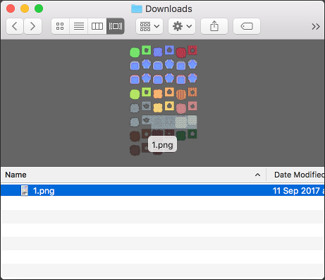

# About

Command-line tools to process tile set images

Provides tileslicer, tilejoiner, tilecutter and tileflipper commands.

## Installation

    go get -u github.com/martinlindhe/tile-tools/...

## Usage - tileslicer

Slices input image into several tiles.

You have a tile map:

You want to slice it into equally sized tiles:

    $ tileslicer 1.png --out ./parts --width 32 --height 32

## Usage - tilejoiner

Combines all images in a folder into a new tile set

You have a bunch of equally sized tiles:

You want to combine them to a tile map:

    $ tilejoiner ./parts --out 1.png --tiles-per-row 6

## Usage - tilecutter

Keeps bottom 1/3:rd of input images

    $ tilecutter --keep-bottom --one-third _tmp

## Usage - tileflipper

Flip (mirror) input image

    $ tileflipper _samples/ground.png --out flipped-ground-h.png --horizontal
    $ tileflipper _samples/ground.png --out flipped-ground-v.png --vertical

## License

Under [MIT](LICENSE)
